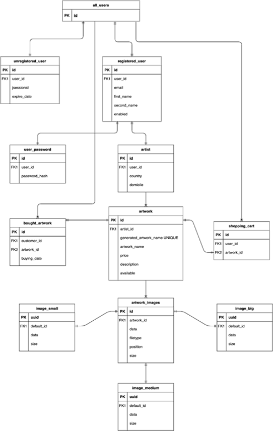
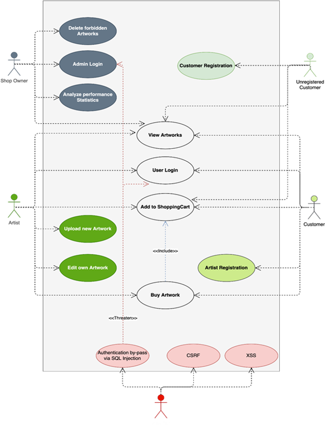

# SAOF - Art Webshop

## Motivation and Goal
The goal of the project is to provide a WebShop for small artists, where they can offer their art to interested customers.
There is a big focus on simplicity: The buying process is outsourced to the artist and the customer to assure transparency.
To project was created, due to a project work during our studies at the [HDBW](https://www.hdbw-hochschule.de/) bachelor program.

* * *

## Deployment

### TODO
- The .env file needs to be changed if necessary

### Docker

There is a [docker-compose.yml](docker-compose.yml) located in the root dir, whicbh builds and deploys spring application and postgreSQL DB.
```shell
docker-compose build 
docker-compose up 
``` 

### Initial Data
There is some Initial DB Data included in the [initial_data](initial_data) directory, which may be imported. It contains some dummy data

* * *

## Implementation
The application is implemented via the Spring Boot Framework.

## Database
In development a PostgreSQL DB was used.




## Roles



For managing the authentication and user roles Spring Security comes in place.
There are multiple roles:
- Anonymous user: When due to an interaction with the server the user has to be keep track of, an anonymous user gets created.
  This interaction may be adding an artwork to the shopping cart. The anonymous user is associated with a session_id, which gets automatically created.
- Registered user: When registering a registered user gets created. This enables the customer to check out his shopping cart.
- Artist: A registered user is able to register as an artist. An artist may create own artworks, which are later on visible in the list of artworks.


## Roadmap
The project is currently in an early version. We are planning on continuously improving it.

### Planned features
- Integration of Big Data forecasting methods
- Admin functionalities
  - Admin Dashboard
- Implementation of NLP


## Credits & Collaborators

### Collaborators
- [Dennis Hug](https://github.com/hugson-d)
- [Leo Schuhmann](https://github.com/LeoSchuhmann)
- [Felix Erhardt]()
